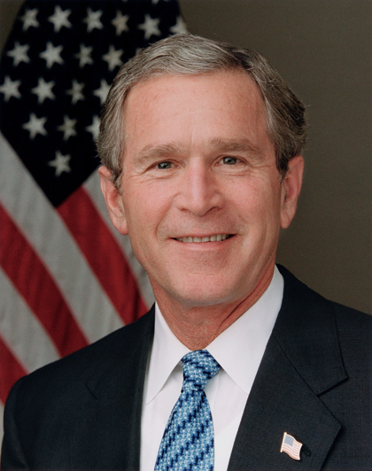
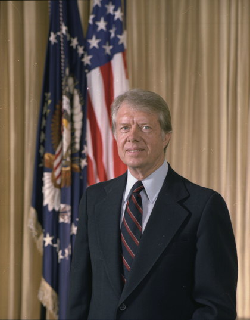
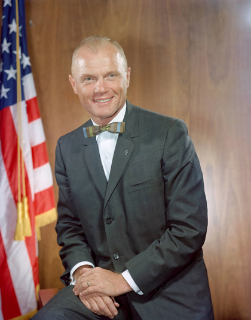
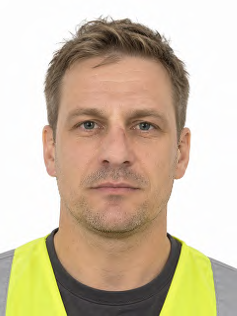
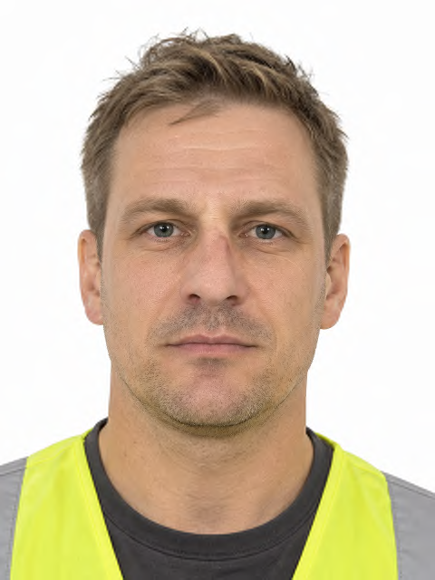
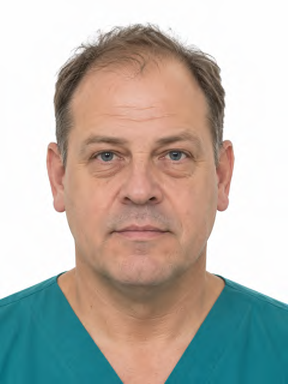

# FaceOFFx: balanced PIV JPEG 2000 portraits for .NET

FaceOFFx is a library for preparing a source-supported PIV portrait and encoding it within
a chosen JPEG 2000 file-size ceiling. It runs locally with embedded face-detection and
landmark models, and returns geometry, color and regional-compression review evidence.

[Library](#library) · [CLI](#cli) · [Encoding](#encoding-and-review) ·
[Gallery](#sample-gallery) · [Development](#development)

## Library

Use the **FaceOFFx NuGet library** for one fixed balanced recipe and one size control.
This checkout builds version **4.0.0**:

```bash
dotnet pack src/FaceOFFx/FaceOFFx.csproj -c Release -o artifacts/packages
```

Add that directory to your consumer's NuGet sources alongside NuGet.org for dependencies,
then reference `FaceOFFx` version4.0.0. The library targets .NET8 and supports .NET8/9/10
applications. The examples below use the package built from this checkout.

```csharp
using FaceOFFx;

using var encoder = new PivImageEncoder();
var result = await encoder.EncodeFileAsync("photo.jpg", PivFileSizeTarget.Minimum);
if (result.IsFailure)
{
    Console.Error.WriteLine(result.Error.Message);
    return;
}

await File.WriteAllBytesAsync("portrait.jp2", result.Value.ImageData);
foreach (var requirement in result.Value.VerificationRequirements)
    Console.WriteLine(requirement);
```

`EncodeAsync(byte[], fileSizeTarget, cancellationToken)` accepts in-memory input. Omitting
the target selects `Minimum`. Reuse the encoder, await calls and dispose it when finished.
Cancellation propagates as `OperationCanceledException`; expected processing failures
return `Result<PivEncodingResult, PipelineError>`.

```csharp
var preferred = await encoder.EncodeFileAsync("photo.jpg", PivFileSizeTarget.Preferred);
var custom = await encoder.EncodeFileAsync("photo.jpg", PivFileSizeTarget.FromBytes(16_000));
```

The immutable result carries JPEG 2000 bytes, output dimensions and landmarks, selected
file-size target, crop/region/color evidence, encoding measurements and merged review
requirements. See [API](docs/API.md) and the [4.0 migration notes](docs/RELEASE-NOTES.md).

## CLI

The CLI is a thin wrapper over the library. With the .NET10 SDK installed, build and run
it from this checkout:

```bash
dotnet build FaceOFFx.sln -c Release
dotnet run --project src/FaceOFFx.Cli -c Release --framework net8.0 -- \
  photo.jpg --filesize-target minimum --output portrait.jp2
```

Use `--filesize-target minimum`, `preferred`, or a positive byte count. `--json` writes
machine-readable evidence; `--debug` sends logs to stderr. The default image path is
`INPUT.piv.jp2`, with evidence at `INPUT.piv.jp2.json`. Existing files require `--overwrite`.
Writes use staged files, individual atomic renames and rollback; interrupted processes
can leave recovery files adjacent to the output.

Exit code **0** means a portrait was encoded within the selected file ceiling and passed
the automated source-support and framing checks. The sidecar keeps enrollment and
regional-compression review requirements visible.

## Encoding and review

The stored canvas is **480×640**, rendered in one uniform affine Lanczos3 pass with native
source support and scale at or below 1. The fixed framing ladder retains head resolution,
eye position and source margins. Anatomical measurements retain their estimated or
verified basis in the result.

The fixed balanced Part 1 recipe uses one tile, one quality layer, irreversible **9/7**,
ICT, **ROI start level 4**, **64×64** code blocks and **luma utility 1.25** on every luma
subband including LL. Chroma utility is 1. Allocation uses the balanced rate-distortion
objective within the complete JP2 ceiling.

The face-centered coding mask is the hull of all 68 jaw, brow, eye, nose and mouth
landmarks with a fixed **3% jaw-width margin**, constructed before allocation. Full-head
framing and inner-mask placement have separate review evidence.

Regional accounting uses `synthesis-energy-decoder-effective-pass-v3`. It apportions
actual packet-body payload using spatial synthesis influence and modeled decoder-retained
coding benefit. For `A` RGB24 pixels, the method estimate is `3*A / attributedFaceBytes`.
Face/outside payload, headers and JP2 boxes reconcile with actual file bytes. The ledger
is an engineering measurement for regional review, with its assumptions documented in
[compression accounting](docs/PIV-COMPRESSION-ACCOUNTING.md).

The on-card face-region requirement is **24:1** under the accepted regional accounting.
The gallery keeps each method estimate visible for that review, alongside actual bytes.

Enrollment qualification requires reviewed ear-attachment and crown measurements,
optical capture resolution, frontal pose, neutral expression, uniform background and
illumination, trusted source/color history, recognition evidence and issuer/card
interoperability. Review regional compression against the applicable NIST requirements
and the recorded measurement convention.

### File-size targets

| Target | Complete JP2 ceiling | Required biometric capacity | Required complete-object capacity |
| --- | ---: | ---: | ---: |
| `Minimum` | 11,820 bytes | 12,704 bytes | 12,710 bytes |
| `Preferred` | 22,000 bytes | 22,884 bytes | 22,890 bytes |
| `FromBytes(N)` | N bytes | N + 884 bytes | `RequiredObjectBytes` |

The container arithmetic reserves **46 FAC**, **88 CBEFF**, **750 signature** and
**6 outer-tag** bytes for the named targets. Custom targets expose size-dependent BER
wrapper arithmetic through `RequiredBiometricValueBytes` and `RequiredObjectBytes`.
Confirm that the credential supports the required capacity and
verify actual record/signature/tag lengths during issuer serialization.

### Source color

Embedded sRGB and EXIF sRGB are recorded automatically. Supported RGB matrix/TRC ICC
profiles are converted to sRGB at source resolution. Other embedded profiles produce a
request for a supported color-managed export. Untagged pixels are automatically treated
as sRGB and recorded as **AssumedSrgb**, with acquisition/color-history review retained.
The source guard permits up to **64 million pixels**.

## Sample gallery

Each row uses the public library with the same fixed recipe at **minimum** and
**preferred** ceilings. Source thumbnails are 420 pixels wide; output previews are native
independent **Pillow/OpenJPEG decodes of the linked JP2 files**. Region links display the
hash-verified coding mask. Each review record includes bytes, source/mask hashes, color
basis, regional estimates and enrollment requirements.

<!-- gallery:start -->
### George W. Bush

| Source | Minimum | Preferred |
| --- | --- | --- |
| <a href="docs/samples/source/bush.png"></a> | Source review required<br>[decision](docs/samples/piv/bush_minimum.json) | Source review required<br>[decision](docs/samples/piv/bush_preferred.json) |

### Jimmy Carter

| Source | Minimum | Preferred |
| --- | --- | --- |
| <a href="docs/samples/source/carter.png"></a> | Source review required<br>[decision](docs/samples/piv/carter_minimum.json) | Source review required<br>[decision](docs/samples/piv/carter_preferred.json) |

### Boris Johnson

| Source | Minimum | Preferred |
| --- | --- | --- |
| <a href="docs/samples/source/johnson.png"></a> | <a href="docs/samples/piv/johnson_minimum.png"></a><br>11,672 JP2 bytes<br>47.568:1 method estimate<br>[JP2](docs/samples/piv/johnson_minimum.jp2) · [region](docs/samples/piv/johnson_minimum_roi.png) · [review](docs/samples/piv/johnson_minimum.json) | <a href="docs/samples/piv/johnson_preferred.png"></a><br>21,977 JP2 bytes<br>19.857:1 method estimate<br>[JP2](docs/samples/piv/johnson_preferred.jp2) · [region](docs/samples/piv/johnson_preferred_roi.png) · [review](docs/samples/piv/johnson_preferred.json) |

### Keir Starmer

| Source | Minimum | Preferred |
| --- | --- | --- |
| <a href="docs/samples/source/starmer.png"></a> | <a href="docs/samples/piv/starmer_minimum.png"></a><br>11,791 JP2 bytes<br>43.064:1 method estimate<br>[JP2](docs/samples/piv/starmer_minimum.jp2) · [region](docs/samples/piv/starmer_minimum_roi.png) · [review](docs/samples/piv/starmer_minimum.json) | <a href="docs/samples/piv/starmer_preferred.png"></a><br>21,841 JP2 bytes<br>17.197:1 method estimate<br>[JP2](docs/samples/piv/starmer_preferred.jp2) · [region](docs/samples/piv/starmer_preferred_roi.png) · [review](docs/samples/piv/starmer_preferred.json) |

### John H. Glenn Jr.

| Source | Minimum | Preferred |
| --- | --- | --- |
| <a href="docs/samples/source/glenn.png"></a> | Source review required<br>[decision](docs/samples/piv/glenn_minimum.json) | Source review required<br>[decision](docs/samples/piv/glenn_preferred.json) |

### Watermarked construction sample

| Source | Minimum | Preferred |
| --- | --- | --- |
| <a href="docs/samples/source/construction.png"></a> | <a href="docs/samples/piv/construction_minimum.png"></a><br>11,658 JP2 bytes<br>44.393:1 method estimate<br>[JP2](docs/samples/piv/construction_minimum.jp2) · [region](docs/samples/piv/construction_minimum_roi.png) · [review](docs/samples/piv/construction_minimum.json) | <a href="docs/samples/piv/construction_preferred.png"></a><br>21,844 JP2 bytes<br>17.707:1 method estimate<br>[JP2](docs/samples/piv/construction_preferred.jp2) · [region](docs/samples/piv/construction_preferred_roi.png) · [review](docs/samples/piv/construction_preferred.json) |

### Watermarked medical sample

| Source | Minimum | Preferred |
| --- | --- | --- |
| <a href="docs/samples/source/medical.png"></a> | <a href="docs/samples/piv/medical_minimum.png"></a><br>11,771 JP2 bytes<br>53.489:1 method estimate<br>[JP2](docs/samples/piv/medical_minimum.jp2) · [region](docs/samples/piv/medical_minimum_roi.png) · [review](docs/samples/piv/medical_minimum.json) | <a href="docs/samples/piv/medical_preferred.png"></a><br>21,962 JP2 bytes<br>21.713:1 method estimate<br>[JP2](docs/samples/piv/medical_preferred.jp2) · [region](docs/samples/piv/medical_preferred_roi.png) · [review](docs/samples/piv/medical_preferred.json) |

### Generic Guy illustration control

| Source | Minimum | Preferred |
| --- | --- | --- |
| <a href="docs/samples/source/generic_guy.png"></a> | Source review required<br>[decision](docs/samples/piv/generic_guy_minimum.json) | Source review required<br>[decision](docs/samples/piv/generic_guy_preferred.json) |
<!-- gallery:end -->

Bush, Carter, Johnson, Starmer and the illustration remain source controls. Construction
and medical use the supplied `datasets/samples/cardholders/source_watermarked` originals,
preserving their watermarks and source hashes. Their provenance remains part of enrollment
review. The illustration is a detector test control.

John H. Glenn Jr.'s historical portrait is an informational test example. Source credit:
[NASA, December 1962](https://www.nasa.gov/image-article/portrait-of-astronaut-john-h-glenn-jr-2/).
Its original asset and hash are recorded in [source metadata](tests/test-images/people/glenn/source.json).
Apply NASA's [media usage guidelines](https://www.nasa.gov/nasa-brand-center/images-and-media/),
including identifiable-person conditions for promotional reuse.

Regenerate with Python, Pillow/OpenJPEG and NumPy installed, and the local watermarked
fixtures available:

```bash
tests/regenerate_docs_images.sh
```

## Development

The encoder-only codec is vendored in **`src/CoreJ2K.FaceOFFx`**, with its license and
upstream notices retained. Build from this repository alone using the .NET10 SDK.
The complete test matrix also needs the .NET8, .NET9 and .NET10 runtimes:

```bash
dotnet build FaceOFFx.sln -c Release
dotnet test FaceOFFx.sln -c Release
dotnet pack src/FaceOFFx/FaceOFFx.csproj -c Release
```

Public lifecycle is in `src/FaceOFFx`, PIV rules in `FaceOFFx.Core`, image/ONNX integration
in `FaceOFFx.Infrastructure`, embedded models in `FaceOFFx.Models`, and the light CLI
in `FaceOFFx.Cli`. Engineering diagnostics export JP2s and evidence; development tooling
independently renders their previews:

```bash
dotnet run --project src/FaceOFFx.Diagnostics.Cli -c Release --framework net8.0 -- \
  docs samples --input photo.jpg --output artifacts/review
python3 scripts/ReadmeGallery/render_diagnostics.py artifacts/review
```

See [contributing](docs/CONTRIBUTING.md), [security](SECURITY.md), the
[vendored codec inventory](sbom/vendored-codec.json) and the
[historical dependency SBOM](sbom/faceoffx-sbom.json). Regenerate the complete dependency
graph for release. Handle portraits and evidence under the enrollment
system's authorization, access-control and retention policies.

## Credits and license

FaceOFFx derives from [FaceONNX](https://github.com/FaceONNX/FaceONNX), using RetinaFace,
PFLD, ONNX Runtime, ImageSharp, the vendored CoreJ2K encoder, CSharpFunctionalExtensions
and Spectre.Console. Dependency licenses accompany package metadata and codec notices.

PIV requirements are drawn from FIPS 201-3, NIST SP 800-76-2, SP 800-73-5, SP 800-85B,
INCITS 385 and ISO/IEC 15444-1. FaceOFFx is licensed under [MIT](LICENSE).
